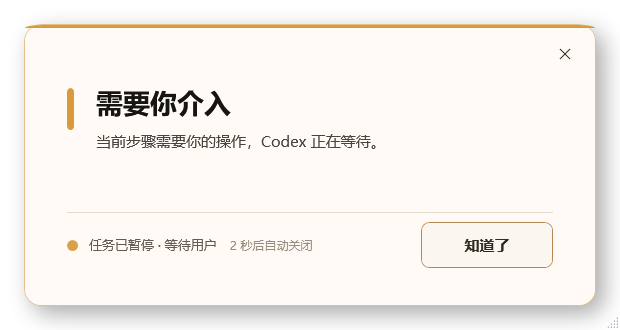
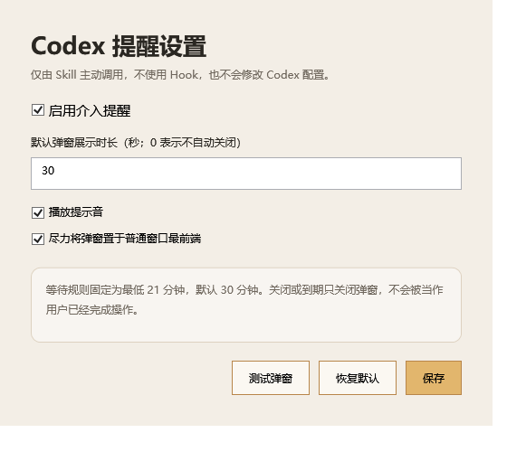

# Codex Notifications

[简体中文](README.zh-CN.md)

A lightweight Windows skill that lets Codex show a task-specific, always-on-top popup when work is genuinely blocked on human intervention.



## What it does

- Notifies you only when Codex cannot safely continue without you, such as login, QR scanning, CAPTCHA, authorization, user-only information, or a consequential choice with no safe default.
- Creates a fresh copy of the popup source for every request, so Codex can freely adapt the layout, fields, buttons, validation, and interaction to the current task.
- Keeps the current Codex task waiting for your real response instead of treating popup close or expiry as approval.
- Always includes **“我很忙，一会再说。”** (“I’m busy, ask me later”) as a non-terminal response.
- Provides a desktop settings shortcut for duration, sound, enable/disable, and foreground behavior.
- Uses no Codex Hooks and does not modify `config.toml`.

## Requirements

- Windows 10 or Windows 11
- PowerShell 7 (`pwsh`) recommended; Windows PowerShell 5.1 is supported
- Codex with local Skills support

## Install

Clone the repository and run the installer:

```powershell
git clone https://github.com/GODGOD126/codex-notifications.git
cd codex-notifications
pwsh -NoProfile -File .\scripts\install.ps1
```

The installer copies the skill to `%USERPROFILE%\.codex\skills\codex-notifications`, creates `%LOCALAPPDATA%\CodexNotifications\settings.json`, and adds **Codex 提醒设置** to the desktop.

Restart Codex after the first installation so it discovers the skill.

To install without the desktop shortcut:

```powershell
pwsh -NoProfile -File .\scripts\install.ps1 -NoDesktopShortcut
```

## Make Codex use it automatically

Add this compact rule to your Codex instructions:

```text
When the task cannot safely continue without my direct intervention—such as login, QR scan, CAPTCHA, authorization, user-only information, or a required physical action—use $codex-notifications to alert me. Do not notify for normal progress, recoverable errors, or completion. After notifying, keep the current task active and wait according to the skill instructions. Do not use Hooks.
```

## Settings

Open **Codex 提醒设置** from the desktop.



The waiting safety rule is intentionally not editable in the settings window: the default wait is 30 minutes and the enforced minimum is 21 minutes. Popup dismissal, expiry, or “I’m busy” never counts as consent or completion.

## Uninstall

Run this from the cloned repository or the installed skill folder:

```powershell
pwsh -NoProfile -File .\scripts\uninstall.ps1
```

Use `-KeepSettings` to preserve local settings and request history.

## Development and verification

```powershell
pwsh -NoProfile -File .\tests\run-tests.ps1
$env:PYTHONUTF8 = '1'
py -3 "$env:USERPROFILE\.codex\skills\.system\skill-creator\scripts\quick_validate.py" .
```

The test suite verifies the no-Hook contract, waiting minimum, dynamic popup copy, structured results, installer behavior, option validation, and that `config.toml` remains unchanged.

## Limitations

- A normal desktop process cannot appear above the Windows lock screen or UAC secure desktop.
- Exclusive full-screen games may prevent ordinary topmost windows from appearing.
- The current Codex task must remain active while it waits; the popup alone cannot wake a task that has already ended.

## Privacy and security

- No telemetry and no network requests are built into the skill.
- No credentials are stored by the installer.
- Request files are kept locally under `%LOCALAPPDATA%\CodexNotifications\requests`.
- Avoid entering secrets into a popup unless the current task explicitly designs a safe lifecycle for them.

## License

[MIT](LICENSE)
